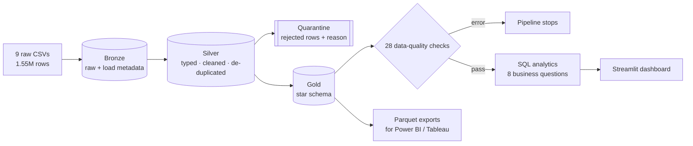
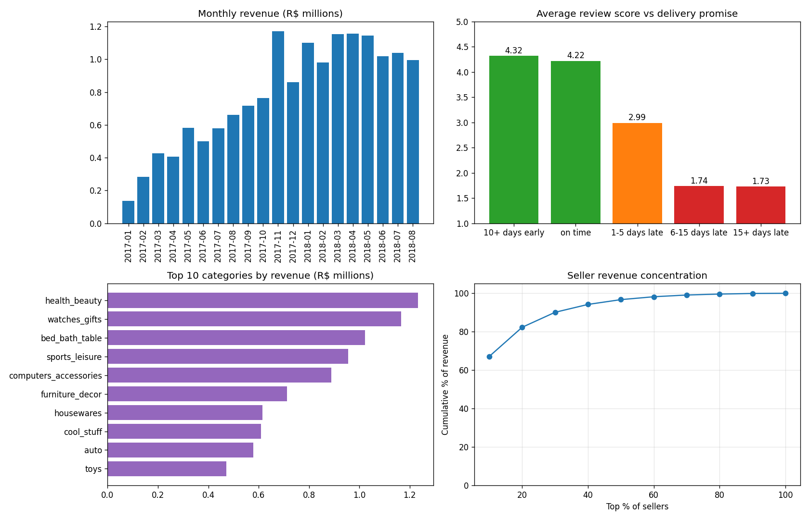

# 🛒 E-commerce Data Pipeline & Analytics Warehouse

An end-to-end data engineering and analytics project on **1.55 million rows** of real Brazilian e-commerce data (Olist): raw CSVs → **bronze / silver / gold** layers → a **star schema** → **automated data-quality checks** → **SQL analytics** that answer business questions → an interactive dashboard and Parquet exports for Power BI.


**Data:** [Brazilian E-Commerce Public Dataset by Olist](https://www.kaggle.com/datasets/olistbr/brazilian-ecommerce) — ~100k orders (2016–2018) across 9 related tables: orders, items, payments, reviews, customers, sellers, products, geolocation and category translations.

## Architecture



The full pipeline runs in **~20 seconds** (`python -m pipeline.run`).

### Star schema (gold)

| Table | Grain | Rows |
|---|---|---|
| `fact_sales` | one order item | 112,642 |
| `fact_orders` | one order | 99,433 |
| `dim_customer` | one **person** (`customer_unique_id`) | 96,096 |
| `dim_product` | one product, English category | 32,951 |
| `dim_seller` | one seller | 3,095 |
| `dim_date` | one calendar day | 1,096 |

> **A trap in this dataset:** Olist gives the same person a new `customer_id` on every order (99,441 ids for 96,096 people). Keying customers on `customer_id` makes every buyer look new and the repeat rate collapse to ~0%. The customer dimension is keyed on the real person.

## Data quality

Profiling the raw data found real problems; each one is handled explicitly rather than silently dropped:

| Issue found | Rows | Handling |
|---|---|---|
| Orders marked *delivered* with no delivery date | 8 | Quarantined with reason |
| Payments with an unknown type (`not_defined`) | 3 | Quarantined with reason |
| Duplicate reviews (up to 3 per order) | 814 rows, 547 orders | Keep the latest answer per order |
| Products with no category / untranslated category | 610 / 2 categories | `unknown` / manual translations |
| Geolocation: ~53 points per zip code, 42 outside Brazil, broken city spellings (`sa£o paulo`) | 1M rows | Median point per zip, bounding-box filter, accent-stripped names |
| Payment ≠ items + freight | 249 orders | Warning (instalment interest) |
| Last two months nearly empty (Sep–Oct 2018) | 20 orders | Excluded from trend analysis |

**28 automated checks** (dbt-test style, `pipeline/quality.py`) run on every build: primary-key uniqueness, not-null, accepted values, value ranges, date logic, referential integrity of every fact → dimension key, and **reconciliation between layers** (bronze orders = silver + quarantined; item revenue identical in silver and gold). *Error* checks stop the pipeline; *warnings* are reported. Current run: **26 passed, 2 warnings, 0 errors** — see [`reports/data_quality.md`](reports/data_quality.md).

The tests also **inject bad data on purpose** (duplicate keys, a negative price, a broken foreign key) and assert that the right check fails.

## Business insights

| Question | Finding |
|---|---|
| **Does late delivery hurt satisfaction?** | Yes, sharply. On-time orders average **4.22 ★** with 10% negative reviews; orders **1–5 days late** drop to **2.99 ★ (41% negative)** and **6+ days late** to **1.74 ★ (78% negative)**. |
| **Do customers come back?** | Rarely: only **3.0%** of customers ever order twice, and just **~2%** of each monthly cohort buys again within 6 months (range 1.7–2.6%). Retention is the biggest growth lever. |
| **Who should marketing target?** | RFM segmentation: **"high spenders at risk"** are 22% of customers but **40% of revenue** — a clear win-back target. |
| **How seasonal are sales?** | Black Friday: **November 2017 revenue +53%** month-over-month. |
| **How concentrated is the marketplace?** | The top **10% of sellers generate 67% of revenue** (top 30% → 90%). |
| **Where is delivery worst?** | Northern and north-eastern states wait up to **23.7 days** (Pará) vs **8.7 days** in São Paulo, with late rates up to 17.5% (Maranhão). |
| **How do customers pay?** | **75.5%** credit card (avg **3.6 instalments**), 19.9% boleto. |
| **Top categories** | health & beauty, watches & gifts, bed/bath/table — the top 3 are 26% of revenue. |



All numbers come from the SQL in [`sql/analytics/`](sql/analytics) (results in `reports/analytics/*.csv`), which uses **CTEs, window functions (`LAG`, `RANK`, `NTILE`, running totals), `QUALIFY`, cohorts and anti-joins**.

## Run it

```bash
pip install -r requirements.txt
kaggle datasets download -d olistbr/brazilian-ecommerce -p data/raw --unzip

python -m pipeline.run                # bronze -> silver -> gold -> checks -> analytics -> exports
streamlit run dashboard/app.py        # dashboard at http://localhost:8501
python -m pytest -q                   # end-to-end tests on data/sample (no download needed)
```

**Power BI / Tableau:** `exports/*.parquet` holds the gold star schema — *Get Data → Parquet*, then relate `fact_sales` / `fact_orders` to the dimensions on the `*_key` columns.

**Try it without Kaggle:** `data/sample/` is a 3,000-order, referentially consistent sample (built by `python -m pipeline.make_sample`) that CI uses:

```bash
PIPELINE_DATA_DIR=data/sample python -m pipeline.run
```

## Project structure

```text
├── pipeline/
│   ├── run.py            # orchestrator: bronze load, SQL layers, checks, exports, analytics
│   ├── quality.py        # data-quality checks (dbt-test style)
│   ├── analytics.py      # runs sql/analytics, saves CSVs + charts
│   ├── make_sample.py    # consistent sample for tests/CI
│   └── config.py
├── sql/
│   ├── silver/           # cleaning, de-duplication, quarantine
│   ├── gold/             # star schema
│   └── analytics/        # 8 business questions
├── dashboard/app.py      # Streamlit: sales, delivery & satisfaction, customers, data quality
├── reports/              # data-quality report, analytics CSVs, charts
├── data/sample/          # small sample (full data: download from Kaggle)
├── tests/                # end-to-end + injected-error tests
└── .github/workflows/ci.yml
```

## Design notes

- **Why DuckDB?** An in-process columnar SQL engine: warehouse-style SQL on a laptop with no server. The SQL is standard and ports directly to Spark SQL, Snowflake or BigQuery; the layer structure (bronze/silver/gold) is the same one used on Databricks.
- **Idempotent:** every run rebuilds all layers from the raw files (`CREATE OR REPLACE`), so re-running never duplicates data.
- **Nothing disappears silently:** rejected rows go to `silver.quarantine` with a reason, and reconciliation checks prove row counts and revenue match between layers.

## Tech stack

SQL · DuckDB · Python · pandas · Parquet · Streamlit · Plotly · pytest · GitHub Actions
